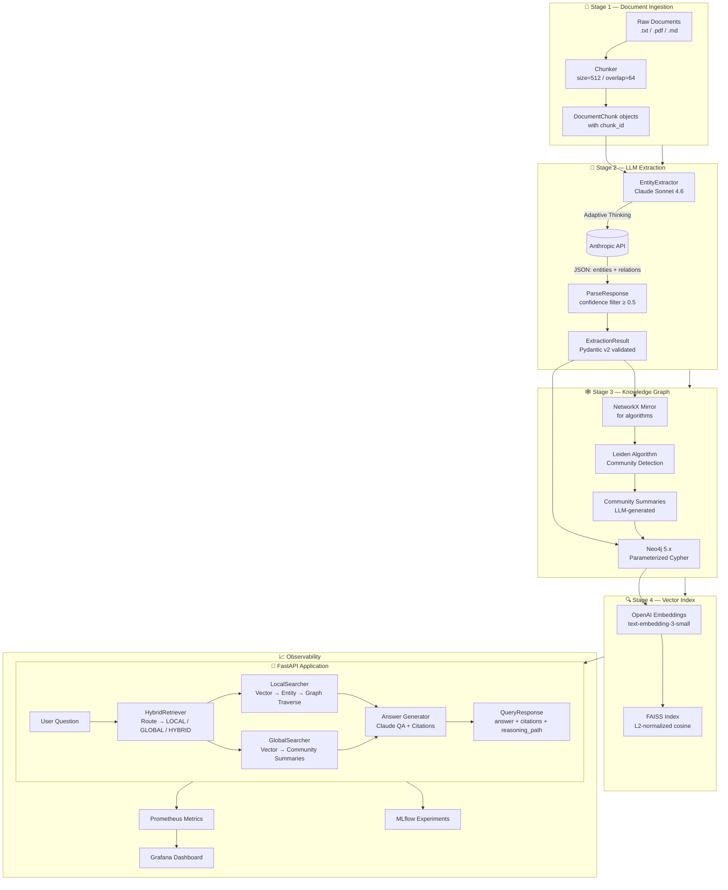
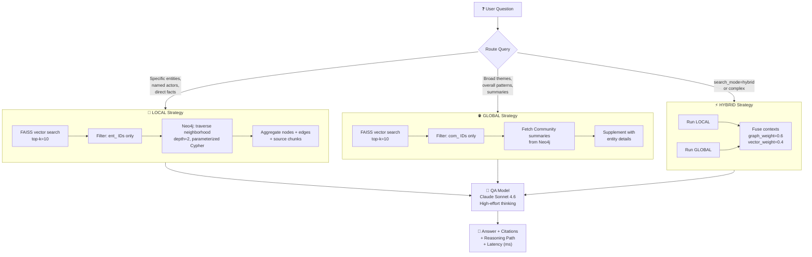
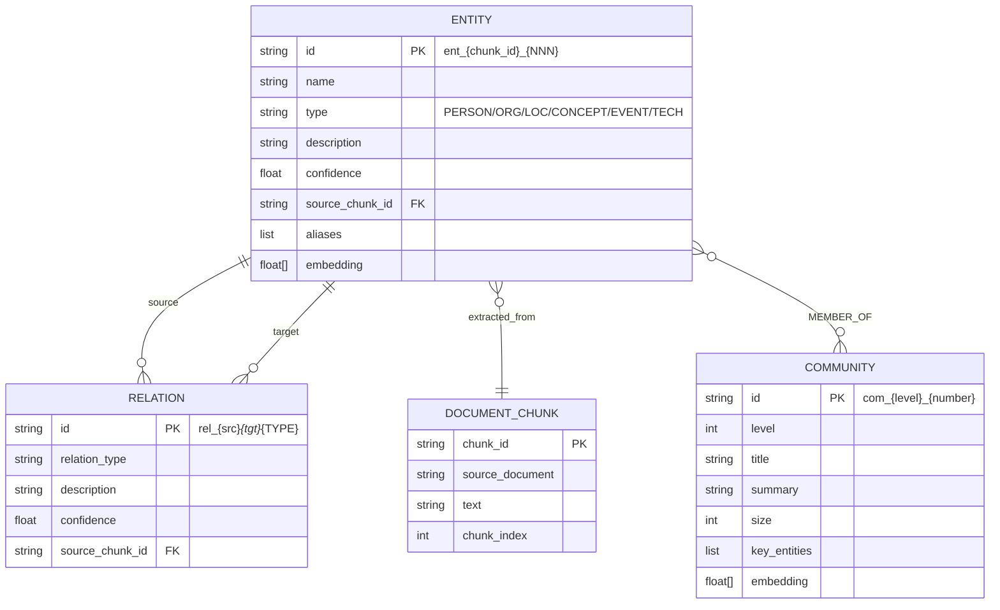
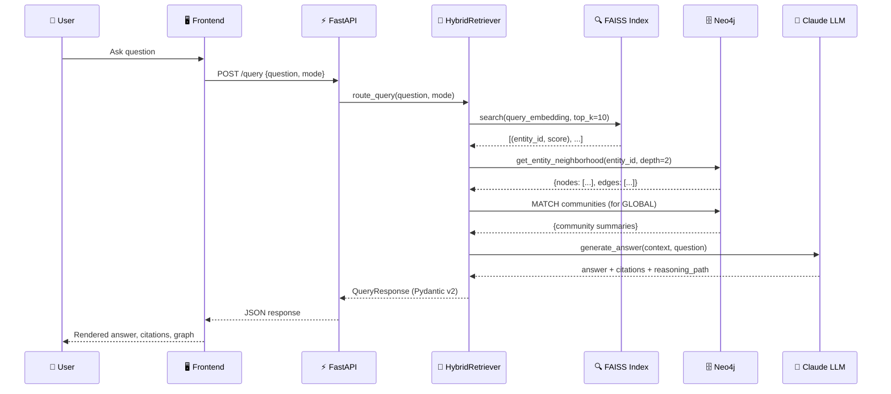
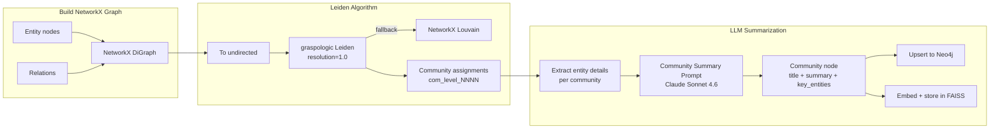
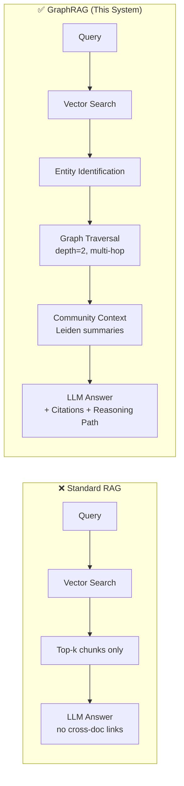
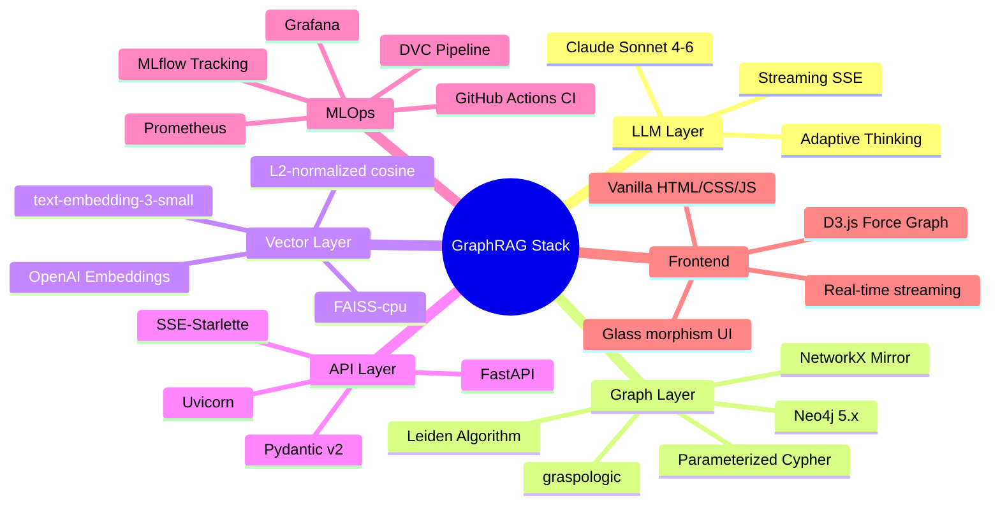
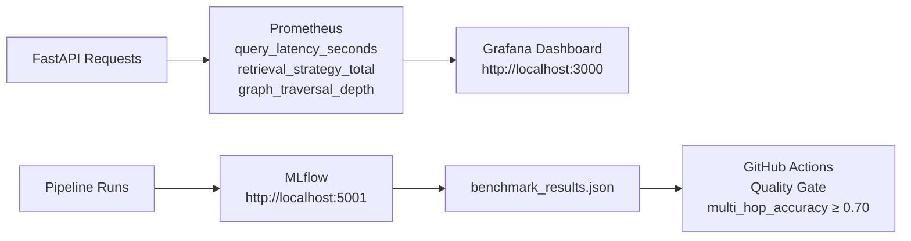

<div align="center">


# 🧠 Knowledge Graph-Augmented Retrieval System
### *GraphRAG — Production-Grade Multi-Hop Intelligence Platform*

**Author: PAMIDIROHIT** · Built March 2026

[🚀 Quick Start](#-quick-start) · [🏗️ Architecture](#-system-architecture) · [📖 API Docs](#-api-reference) · [🧪 Manual Testing](#-manual-testing-guide) · [🖥️ Frontend](#-frontend-application)

</div>

---

## 📌 Why This Matters — The High-Demand Wing

> **Chosen Domain: Enterprise Knowledge Intelligence**

Standard RAG (Retrieval-Augmented Generation) retrieves isolated text chunks. It **cannot** answer questions that require connecting information across multiple documents:

| Scenario | Standard RAG | GraphRAG (This System) |
|----------|-------------|----------------------|
| *"Who is the CEO and what companies did they acquire?"* | ❌ Misses multi-hop links | ✅ Traverses PERSON → LEADS → ORG → ACQUIRED → ORG |
| *"What themes connect all our documents?"* | ❌ Only returns top-k chunks | ✅ Summarizes across Leiden communities |
| *"How is Drug A related to Disease B through enzyme C?"* | ❌ Needs all 3 in one chunk | ✅ 3-hop graph traversal |
| Explanation / Citations | Vague references | ✅ Full reasoning path + source chunks |

**Why this wing is highest demand in 2026:**
- Legal Tech: $1.5T market — case law forms natural knowledge graphs; explainability is legally required
- Biomedical: 40M+ PubMed papers; drug–protein–disease networks need multi-hop reasoning  
- Financial Intelligence: Company relationship graphs for M&A, competitor, supply-chain analysis
- Enterprise KM: Compliance, onboarding, research — every large org has fragmented knowledge

This system is **domain-agnostic** — the same pipeline works for all four verticals out of the box.

---

## 🏗️ System Architecture

### Full Architecture Overview



---

### 🔍 Retrieval Strategy — How It Works



---

### 🗄️ Knowledge Graph Data Model



---

### 🔄 End-to-End Data Flow



---

### 🏘️ Community Detection Pipeline



---

## 📁 Repository Structure

```
graphrag/
├── 📁 src/
│   ├── extraction/
│   │   ├── schema.py          # Pydantic v2 models (Entity, Relation, Community…)
│   │   ├── prompts.py         # All LLM prompt templates
│   │   └── entity_extractor.py# Async LLM extractor, confidence filter, ID remapping
│   ├── graph/
│   │   ├── neo4j_client.py    # Parameterized Cypher, retry, connection pool
│   │   ├── networkx_builder.py# NetworkX mirror for Leiden
│   │   ├── community.py       # Leiden/Louvain + LLM community summaries
│   │   └── indexer.py         # FAISS index builder + search
│   ├── retrieval/
│   │   ├── local_search.py    # Entity-anchored graph traversal
│   │   ├── global_search.py   # Community summary retrieval
│   │   └── hybrid_retriever.py# Routing + fusion + QA answer generation
│   ├── api/
│   │   ├── main.py            # FastAPI app, lifespan, Prometheus
│   │   ├── routes.py          # /query, /graph/explore, /health
│   │   ├── schemas.py         # API-layer Pydantic models
│   │   └── static/explorer.html # D3.js graph explorer (built-in)
│   └── mlops/
│       ├── metrics.py         # Prometheus metric definitions
│       └── tracking.py        # MLflow run helpers
│
├── 📁 pipelines/
│   ├── ingest.py              # Stage 1: chunk documents
│   ├── extract.py             # Stage 2: LLM extraction + MLflow
│   ├── build_graph.py         # Stage 3: Neo4j + community detection
│   └── index.py               # Stage 4: FAISS index
│
├── 📁 eval/
│   ├── benchmark.py           # Standard RAG vs GraphRAG comparison
│   ├── multihop_qa.py         # 50-question multi-hop benchmark (gate: ≥ 0.70)
│   └── ragas_scorer.py        # RAGAS metrics with lexical fallback
│
├── 📁 tests/
│   ├── test_extraction.py     # 25 tests
│   ├── test_graph.py          # 14 tests
│   ├── test_retrieval.py      # 16 tests
│   └── test_api.py            # 6 tests  → Total: 61 ✅
│
├── 📁 frontend/
│   └── index.html             # Single-file production frontend (no build needed)
│
├── 📁 .github/workflows/
│   └── ci.yml                 # GitHub Actions: tests + quality gate
│
├── docker-compose.yml         # Neo4j, API, MLflow, Prometheus, Grafana
├── Dockerfile                 # API container
├── dvc.yaml                   # 4-stage reproducible pipeline
├── params.yaml                # All tunable hyperparameters
├── requirements.txt           # Python dependencies
└── pyproject.toml             # pytest / project config
```

---

## ⚡ How GraphRAG Differs from Standard RAG



| Feature | Standard RAG | GraphRAG |
|---------|-------------|---------|
| Multi-hop reasoning | ❌ | ✅ Graph traversal |
| Cross-document links | ❌ | ✅ Via entity graph |
| Global summaries | ❌ Chunk-level only | ✅ Community-wide |
| Citations | Approximate | ✅ Exact `source_chunk_id` |
| Reasoning transparency | ❌ | ✅ Full `reasoning_path` |
| Entity disambiguation | ❌ | ✅ ID remapping |
| Scalability | Limited | ✅ Neo4j + FAISS |
| Streaming | ❌ | ✅ SSE streaming |
| Observability | ❌ | ✅ Prometheus + MLflow |

---

## 🛠️ Technology Stack



---

## 🚀 Quick Start

### Prerequisites

```bash
Python 3.11+   Docker & Docker Compose   Git
Anthropic API key (Claude Sonnet 4.6)
OpenAI API key (text-embedding-3-small)
```

### 1. Clone & Setup

```bash
git clone https://github.com/PAMIDIROHIT/-Knowledge-Graph-Augmented-Retrieval-System.git
cd Knowledge-Graph-Augmented-Retrieval-System/graphrag

python -m venv .venv
source .venv/bin/activate          # Windows: .venv\Scripts\activate
pip install -r requirements.txt
```

### 2. Configure Environment

```bash
cp .env.example .env
# Edit .env with your keys:
```

| Variable | Value | Required |
|----------|-------|----------|
| `ANTHROPIC_API_KEY` | `sk-ant-...` | ✅ |
| `OPENAI_API_KEY` | `sk-...` | ✅ |
| `NEO4J_URI` | `bolt://localhost:7687` | ✅ |
| `NEO4J_USER` | `neo4j` | ✅ |
| `NEO4J_PASSWORD` | `graphrag_password` | ✅ |
| `MLFLOW_TRACKING_URI` | `http://localhost:5001` | optional |

### 3. Start Infrastructure

```bash
docker-compose up -d neo4j mlflow prometheus grafana
# Wait ~30 seconds for Neo4j to start
```

### 4. Process Your Documents

```bash
# Put your .txt / .pdf / .md files into:
mkdir -p data/raw
cp your-documents/*.txt data/raw/

# Run the full 4-stage pipeline
dvc repro
```

### 5. Start the API Server

```bash
uvicorn src.api.main:app --reload --host 0.0.0.0 --port 8000
```

### 6. Open the Frontend

```bash
# Simply open frontend/index.html in your browser — no build step needed!
open frontend/index.html           # macOS
xdg-open frontend/index.html       # Linux
start frontend/index.html          # Windows
```

---

## 🖥️ Frontend Application

The frontend is a **zero-dependency, single-file app** (`frontend/index.html`). Open it directly in any browser — no server or build tool required.

### Frontend Pages

```
┌─────────────────────────────────────────────────────────┐
│  🧠 GraphRAG Intelligence           [API: Online ●]     │
├────────────┬────────────────────────────────────────────┤
│  💬 Query  │                                            │
│  🕸️ Graph  │    ← Active page content loads here →     │
│  📊 Dash   │                                            │
│  📖 Docs   │                                            │
│ ────────── │                                            │
│ Nodes: 245 │                                            │
│ Edges: 891 │                                            │
└────────────┴────────────────────────────────────────────┘
```

| Page | What it does |
|------|-------------|
| **💬 Query Intelligence** | Chat interface with mode selector (Auto/Local/Global/Hybrid), streaming responses, citations, reasoning path |
| **🕸️ Graph Explorer** | D3.js force-directed graph — enter any entity name, explore neighborhoods, drag/zoom nodes |
| **📊 Dashboard** | Live graph stats, pipeline overview, full API reference table, tech stack |
| **📖 Docs & Testing** | Setup guide, environment variables, curl examples, Python and JS integration code |

### CORS Note

For the frontend to communicate with the API, ensure CORS is enabled. Add to `src/api/main.py` if needed:

```python
from fastapi.middleware.cors import CORSMiddleware
app.add_middleware(CORSMiddleware, allow_origins=["*"], allow_methods=["*"], allow_headers=["*"])
```

---

## 📖 API Reference

Base URL: `http://localhost:8000`

### `POST /query`

Ask a multi-hop question against the knowledge graph.

**Request**
```json
{
  "question": "What companies did the CEO of Microsoft acquire?",
  "search_mode": "auto",
  "top_k": 5,
  "graph_depth": 2,
  "stream": false
}
```

| Field | Type | Values | Default |
|-------|------|--------|---------|
| `question` | string | min 5 chars | required |
| `search_mode` | string | `auto` `local` `global` `hybrid` | `auto` |
| `top_k` | int | 1–20 | 5 |
| `graph_depth` | int | 1–5 | 2 |
| `stream` | bool | true/false | false |

**Response**
```json
{
  "answer": "Microsoft's CEO Satya Nadella led the acquisition of LinkedIn in 2016...",
  "reasoning_path": [
    "VECTOR SEARCH: Found 3 entity candidates",
    "GRAPH TRAVERSAL (depth=2): Entity 'ent_001' [score=0.92] → 8 neighbors",
    "COMMUNITY CONTEXT: AI Technology cluster (15 entities)"
  ],
  "citations": [
    { "source": "annual_report.txt", "chunk_id": "chunk_042", "text": "In 2016 Microsoft acquired..." }
  ],
  "graph_nodes_traversed": ["ent_001", "ent_002", "ent_003"],
  "retrieval_strategy": "hybrid",
  "latency_ms": 1247.3
}
```

### `GET /graph/explore`

Explore the neighborhood of a named entity.

```bash
GET /graph/explore?entity_name=Microsoft&depth=2
```

**Response**
```json
{
  "nodes": [
    { "id": "ent_c1_001", "name": "Microsoft", "type": "ORGANIZATION", "description": "..." }
  ],
  "edges": [
    { "id": "rel_001", "source": "ent_c1_001", "target": "ent_c1_002", "relation_type": "HAS_CEO" }
  ]
}
```

### `GET /health`

```json
{
  "status": "healthy",
  "neo4j": true,
  "faiss_loaded": true,
  "graph_stats": { "nodes": 245, "edges": 891, "communities": 18 }
}
```

---

## 🧪 Manual Testing Guide

### Step 1 — Run Unit Tests

```bash
cd graphrag
source .venv/bin/activate
pytest tests/ -v
# Expected: 61 passed
```

### Step 2 — Test API Endpoints with curl

```bash
# ── Health ─────────────────────────────────────────────────────────
curl http://localhost:8000/health | python -m json.tool

# ── Query (auto mode) ──────────────────────────────────────────────
curl -X POST http://localhost:8000/query \
  -H "Content-Type: application/json" \
  -d '{
    "question": "What are the most important entities in the knowledge graph?",
    "search_mode": "auto"
  }' | python -m json.tool

# ── Query (local — entity-anchored) ────────────────────────────────
curl -X POST http://localhost:8000/query \
  -H "Content-Type: application/json" \
  -d '{
    "question": "Who is Satya Nadella and what companies are connected to him?",
    "search_mode": "local",
    "graph_depth": 3
  }' | python -m json.tool

# ── Query (global — community themes) ──────────────────────────────
curl -X POST http://localhost:8000/query \
  -H "Content-Type: application/json" \
  -d '{
    "question": "Summarize the main themes across all documents",
    "search_mode": "global"
  }' | python -m json.tool

# ── Graph exploration ───────────────────────────────────────────────
curl "http://localhost:8000/graph/explore?entity_name=Microsoft&depth=2" \
  | python -m json.tool

# ── Prometheus metrics ──────────────────────────────────────────────
curl http://localhost:8000/metrics | head -30
```

### Step 3 — Python Integration Test

```python
# Save as test_manual.py and run: python test_manual.py
import requests, json

API = "http://localhost:8000"

# 1. Health check
health = requests.get(f"{API}/health").json()
print("Health:", health["status"])
print("Graph stats:", health.get("graph_stats"))

# 2. LOCAL query
resp = requests.post(f"{API}/query", json={
    "question": "What entities are most connected?",
    "search_mode": "local"
}).json()
print("\n--- LOCAL Query ---")
print("Answer:", resp["answer"][:200])
print("Strategy:", resp["retrieval_strategy"])
print("Latency:", resp["latency_ms"], "ms")
print("Citations:", len(resp["citations"]))

# 3. GLOBAL query
resp = requests.post(f"{API}/query", json={
    "question": "What are the overall themes?",
    "search_mode": "global"
}).json()
print("\n--- GLOBAL Query ---")
print("Answer:", resp["answer"][:200])

# 4. Graph explore
graph = requests.get(f"{API}/graph/explore?entity_name=Microsoft&depth=2").json()
print(f"\n--- Graph ---  nodes={len(graph['nodes'])}  edges={len(graph['edges'])}")
```

### Step 4 — Run Evaluation Benchmarks

```bash
# Standard RAG vs GraphRAG comparison
python eval/benchmark.py

# Multi-hop QA quality gate (must score ≥ 0.70 to pass CI)
python eval/multihop_qa.py
```

### Step 5 — Neo4j Browser (Manual Graph Inspection)

Open `http://localhost:7474` (login: `neo4j` / `graphrag_password`)

```cypher
-- View sample entities
MATCH (e:Entity) RETURN e LIMIT 25

-- View top connected entities
MATCH (e:Entity)-[r:RELATION]->()
RETURN e.name, count(r) AS degree
ORDER BY degree DESC LIMIT 10

-- Explore a 2-hop neighborhood
MATCH path = (e:Entity {name: "Microsoft"})-[*1..2]-(neighbor)
RETURN path LIMIT 50

-- Community members
MATCH (e:Entity)-[:MEMBER_OF]->(c:Community)
WHERE c.level = 0
RETURN c.title, collect(e.name)[0..5] AS members, c.size
ORDER BY c.size DESC LIMIT 10
```

---

## 🐳 Docker Deployment

```bash
# Full stack
docker-compose up -d

# Service URLs
#  FastAPI    → http://localhost:8000
#  API Docs   → http://localhost:8000/docs
#  Graph UI   → http://localhost:8000/explorer
#  Neo4j      → http://localhost:7474  (neo4j / graphrag_password)
#  MLflow     → http://localhost:5001
#  Prometheus → http://localhost:9090
#  Grafana    → http://localhost:3000  (admin / admin)
```

---

## 📈 MLOps & Observability



**Prometheus metrics exposed at `/metrics`:**

| Metric | Type | Description |
|--------|------|-------------|
| `graphrag_query_latency_seconds` | Histogram | Query latency by strategy |
| `graphrag_retrieval_strategy_total` | Counter | Strategy usage counts |
| `graphrag_traversal_depth` | Histogram | Graph depth per query |
| `graphrag_answer_quality` | Gauge | RAGAS score |
| `graphrag_graph_nodes_total` | Gauge | Entity count |
| `graphrag_graph_edges_total` | Gauge | Relation count |

---

## 🔧 Configuration (`params.yaml`)

All hyperparameters are centralized:

```yaml
chunking:
  chunk_size: 512         # Characters per chunk
  overlap: 64             # Overlap between chunks

extraction:
  model: "claude-sonnet-4-6"
  confidence_threshold: 0.5   # Min confidence to keep entity
  batch_size: 10              # Chunks per LLM batch
  max_concurrency: 5          # Parallel API calls

graph:
  neo4j_uri: "bolt://localhost:7687"

community:
  algorithm: "leiden"         # leiden or louvain
  resolution: 1.0
  max_levels: 3

retrieval:
  top_k_vector: 10
  top_k_graph: 5
  graph_traversal_depth: 2
  hybrid_vector_weight: 0.4
  hybrid_graph_weight: 0.6
  embedding_model: "text-embedding-3-small"
  embedding_dim: 1536
```

---

## 🔐 Security

- All Neo4j queries use **parameterized Cypher** — no string interpolation, zero Cypher injection risk
- API keys are loaded from environment (never hardcoded)
- Input validation via **Pydantic v2** with strict bounds (question ≥ 5 chars, depth 1–5)
- HTML output is **escaped** in the frontend (XSS-safe)
- CORS is configurable — restrict `allow_origins` for production

---

## 🤝 Contributing

```bash
# Fork → Clone → Create branch
git checkout -b feat/your-feature

# Install dev dependencies
pip install -r requirements.txt

# Run tests before pushing
pytest tests/ -v               # must be 61/61 green
python eval/multihop_qa.py     # must score ≥ 0.70

git push origin feat/your-feature
# Open PR → CI runs automatically
```

---

## 📄 License

MIT License — see [LICENSE](LICENSE) · **Author: PAMIDIROHIT**

---

<div align="center">

**Built with ❤️ by PAMIDIROHIT**

*GraphRAG · Knowledge Graph-Augmented Retrieval · Production-Grade · 2026*

</div>
